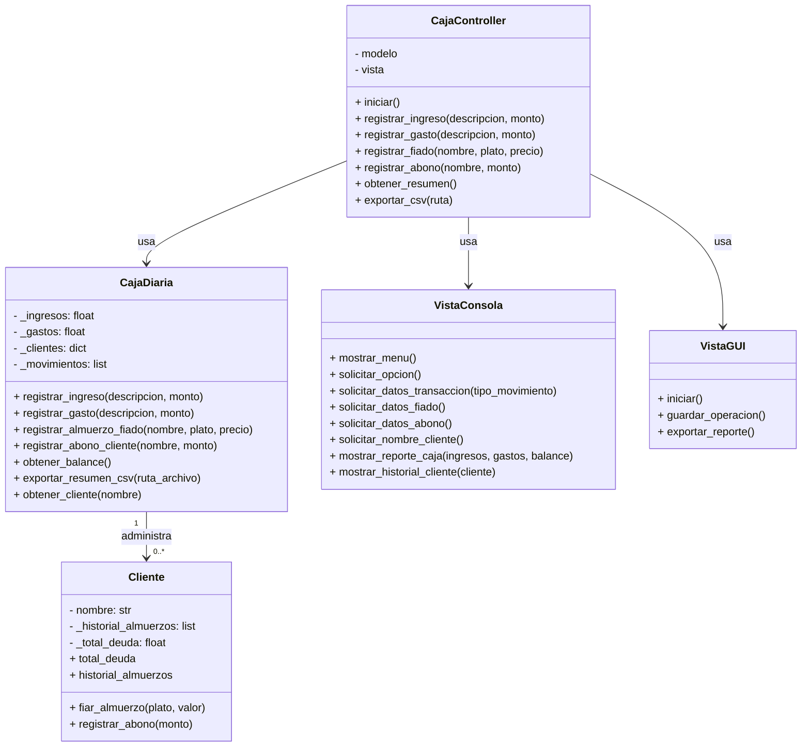

# Sistema de Control de Caja y Fiados del Restaurante

## Descripción
Este proyecto permite registrar ventas, gastos, almuerzos fiados y abonos de clientes para controlar la caja diaria de un restaurante. Además, ofrece una interfaz gráfica para facilitar el uso del sistema y la exportación de reportes en formato CSV.

## Objetivo
El objetivo general del proyecto es organizar y controlar de forma clara los ingresos, egresos y deudas pendientes del restaurante, ayudando a tomar decisiones rápidas y evitar pérdidas por un manejo manual de la caja.

## Características principales
- Registro de ingresos y gastos diarios.
- Control de cuentas pendientes para clientes.
- Visualización del balance neto de la caja.
- Historial detallado de consumos por cliente.
- Exportación de reportes a CSV.

## Tecnologías utilizadas
- Python
- Tkinter
- Rich
- Pandas
- Pytest
- GitHub

## Arquitectura del proyecto
El proyecto sigue el patrón MVC:

- Modelo: la clase `CajaDiaria` gestiona los datos de ingresos, gastos, clientes y movimientos.
- Vista: las clases de la carpeta `app/views` muestran la información al usuario y capturan entradas.
- Controlador: la clase `CajaController` recibe las acciones del usuario y coordina la comunicación entre el modelo y la vista.

## Diagrama de clases


## Instalación
```bash
git clone <URL_DEL_REPOSITORIO>
cd restaurante_contro
python -m pip install -r requirements.txt
```

## Ejecución
```bash
python app/main.py
```

## Pruebas
```bash
pytest
```

## Capturas de pantalla
Las capturas obligatorias deben guardarse en [docs/capturas](docs/capturas).

Se recomienda incluir:
1. Menú principal o pantalla inicial.
2. Una funcionalidad importante del sistema.
3. Un reporte o resultado guardado.
4. Ejecución de las pruebas con `pytest`.
5. Vista del repositorio en GitHub.

## Integrantes
- Diego Alberto Gonzalez Ariza

## Licencia
Este proyecto utiliza la licencia MIT.

---

## Documentación adicional
- [docs/diagrama_clases.md](docs/diagrama_clases.md)
- [docs/proceso_desarrollo.md](docs/proceso_desarrollo.md)

