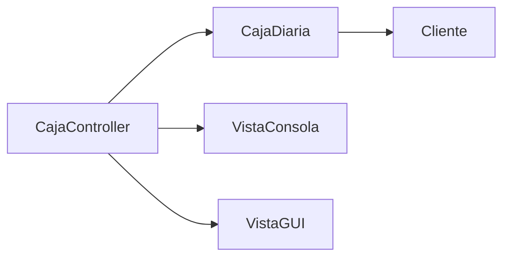

# Diagrama de clases

El sistema está organizado en tres capas principales:

- **Modelo**: `CajaDiaria` y `Cliente`.
- **Vista**: `VistaConsola` y `VistaGUI`.
- **Controlador**: `CajaController`.

## Relación entre clases
- `CajaDiaria` gestiona varios objetos `Cliente`.
- `CajaController` recibe una instancia de `CajaDiaria` y usa la vista para interactuar.
- `VistaConsola` muestra los datos al usuario y recibe entradas desde la consola.
- `VistaGUI` ofrece una interfaz gráfica para registrar operaciones y exportar reportes.

## Resumen visual

